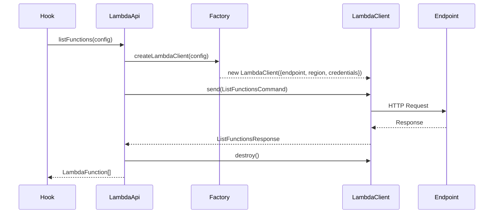

# Technical Specification: Lambda Functions Feature

## Architecture Overview

```mermaid
graph TB
    subgraph SharedLayer[Shared Infrastructure]
        SettingsCtx[SettingsContext<br/>endpoint, region]
        AWSFactory[createLambdaClient()<br/>extends createSqsClient pattern]
        ReactQuery[TanStack React Query<br/>caching, invalidation]
        UIPrimitives[shadcn/ui Components<br/>Table, Dialog, Button, etc.]
    end

    subgraph LambdaFeature[Lambda Feature Module]
        LambdaApi[features/lambda/api/lambda.ts<br/>listFunctions, getFunction, invokeFunction]
        LambdaHooks[features/lambda/hooks/<br/>useFunctions, useFunction, useInvokeFunction]
        LambdaComponents[features/lambda/components/<br/>FunctionTable, FunctionDetailDialog, InvocationPanel]
        LambdaPage[pages/LambdaPage.tsx]
    end

    SettingsCtx --> AWSFactory
    AWSFactory --> LambdaApi
    LambdaApi --> LambdaHooks
    LambdaHooks --> LambdaComponents
    LambdaComponents --> LambdaPage
    ReactQuery --> LambdaHooks
    UIPrimitives --> LambdaComponents
```

## Data Structures

### Type Definitions (`features/lambda/types/lambda.ts`)

```typescript
export interface LambdaFunction {
  functionName: string;
  functionArn: string;
  runtime: string;
  handler: string;
  codeSize: number;
  description: string;
  timeout: number;
  memorySize: number;
  lastModified: string;
  codeSha256: string;
  version: string;
  vpcConfig?: VpcConfig;
  environment?: EnvironmentConfig;
  layers?: Layer[];
}

export interface VpcConfig {
  vpcId: string;
  subnetIds: string[];
  securityGroupIds: string[];
}

export interface EnvironmentConfig {
  variables: Record<string, string>;
}

export interface Layer {
  arn: string;
  codeSize: number;
}

export interface InvocationRequest {
  functionName: string;
  payload: string;
  invocationType?: 'RequestResponse' | 'Event' | 'DryRun';
  logType?: 'None' | 'Tail';
}

export interface InvocationResponse {
  statusCode: number;
  payload: string;
  logResult?: string;
  executedVersion?: string;
  functionError?: string;
}
```

## API Layer (`features/lambda/api/lambda.ts`)

Reuses the SQS API pattern:



### Operations

| Operation | AWS SDK Command | Description |
|-----------|-----------------|-------------|
| `listFunctions` | `ListFunctionsCommand` | List all functions |
| `getFunction` | `GetFunctionCommand` | Get function code + config |
| `invokeFunction` | `InvokeCommand` | Invoke with payload |
| `createFunction` | `CreateFunctionCommand` | Create new function (optional) |

## Hooks Layer (`features/lambda/hooks/`)

Following SQS hooks pattern:

```typescript
// useFunctions.ts - mirrors useQueues.ts
export function useFunctions() {
  const queryClient = useQueryClient();
  const { endpoint, settings } = useSettings();
  const queryKey = ['lambda', 'functions', endpoint, settings.region];

  const query = useQuery({
    queryKey,
    queryFn: () => listFunctions({ endpoint, region: settings.region }),
    staleTime: 30_000,
    refetchInterval: 60_000,
  });

  return { functions: query.data ?? [], loading: query.isLoading, error: query.error, refetch: ... };
}

// useInvokeFunction.ts - mutation hook for invocation
export function useInvokeFunction() {
  const queryClient = useQueryClient();
  const { endpoint, settings } = useSettings();

  return useMutation({
    mutationFn: (req: InvocationRequest) => invokeFunction(req, { endpoint, region: settings.region }),
    onSuccess: () => { /* toast success */ },
    onError: (err) => { /* toast error */ },
  });
}
```

## Components (`features/lambda/components/`)

| Component | SQS Analogue | Purpose |
|-----------|--------------|---------|
| `FunctionTable` | `QueueTable` | List functions with actions |
| `FunctionRow` | `QueueRow` | Single function row with invoke button |
| `FunctionDetailDialog` | `MessageViewer` | Show full function config |
| `InvocationPanel` | `MessageViewer` | Invoke function, show response/logs |
| `CreateFunctionDialog` | - | Optional: create new function |
| `RefreshButton` | `RefreshButton` | Shared component |

## Routing

Add to `src/routes.ts` (already present):
```typescript
{ path: '/lambda', label: 'Lambda', element: createElement(LambdaPage) }
```

## Shared AWS Client Extension

Extend `src/services/aws.ts` with Lambda client factory:

```typescript
import { LambdaClient } from '@aws-sdk/client-lambda';

export function createLambdaClient(config: AwsClientConfig = {}) {
  const { endpoint = 'http://localhost:4566', region = 'us-east-1', credentials = { accessKeyId: 'test', secretAccessKey: 'test' } } = config;
  return new LambdaClient({ region, endpoint, credentials });
}
```

## Dependencies

Add to `package.json`:
```json
"@aws-sdk/client-lambda": "^3.699.0"
```

## Security

- No credentials stored in frontend
- Uses local emulator endpoint from settings
- CORS handled by ministack container