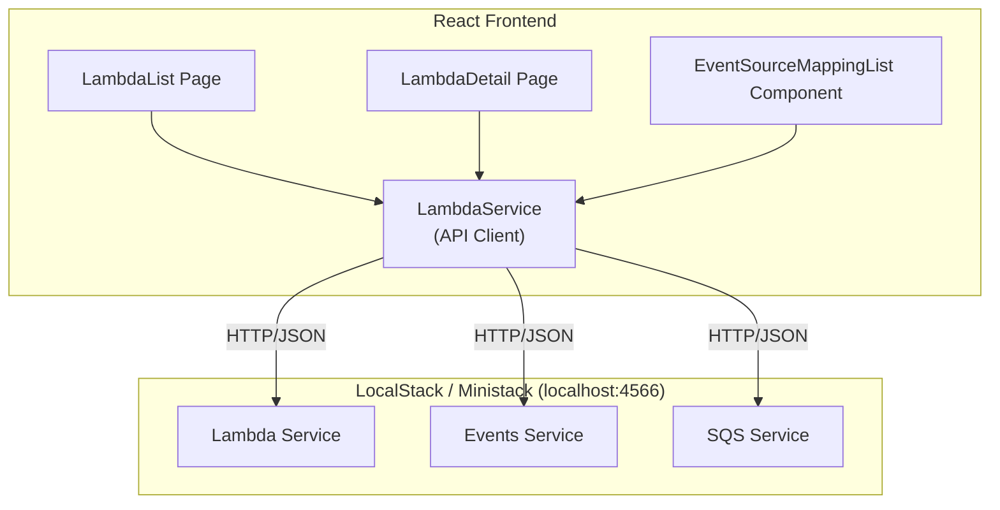

# Technical Specification: Lambda Management

## Architecture Overview



## API Endpoints (LocalStack/Ministack)

### Lambda Service
| Operation | Endpoint | Method |
|-----------|----------|--------|
| ListFunctions | `/2015-03-31/functions` | GET |
| GetFunction | `/2015-03-31/functions/{FunctionName}` | GET |
| GetFunctionConfiguration | `/2015-03-31/functions/{FunctionName}/configuration` | GET |

### Event Source Mappings (via Lambda API)
| Operation | Endpoint | Method |
|-----------|----------|--------|
| ListEventSourceMappings | `/2015-03-31/event-source-mappings` | GET |
| GetEventSourceMapping | `/2015-03-31/event-source-mappings/{UUID}` | GET |
| CreateEventSourceMapping | `/2015-03-31/event-source-mappings` | POST |
| UpdateEventSourceMapping | `/2015-03-31/event-source-mappings/{UUID}` | PUT |
| DeleteEventSourceMapping | `/2015-03-31/event-source-mappings/{UUID}` | DELETE |

### SQS Service (for queue details)
| Operation | Endpoint | Method |
|-----------|----------|--------|
| GetQueueAttributes | `/?Action=GetQueueAttributes` | POST |
| GetQueueUrl | `/?Action=GetQueueUrl` | POST |

## Data Structures

### Lambda Function (List View)
```typescript
interface LambdaFunctionSummary {
  functionName: string;
  functionArn: string;
  runtime: string;
  handler: string;
  memorySize: number;
  timeout: number;
  lastModified: string; // ISO 8601
  version: string;
  codeSize: number;
  description?: string;
}
```

### Lambda Function (Detail View)
```typescript
interface LambdaFunctionDetail extends LambdaFunctionSummary {
  code: {
    repositoryType: string;
    location?: string;        // S3 URL
    imageUri?: string;        // Container image
    resolvedImageUri?: string;
  };
  environment?: {
    variables: Record<string, string>;
  };
  layers?: Array<{ arn: string; codeSize: number }>;
  state: 'Active' | 'Inactive' | 'Failed';
  stateReason?: string;
  stateReasonCode?: string;
  vpcConfig?: {
    vpcId: string;
    subnetIds: string[];
    securityGroupIds: string[];
  };
  tracingConfig?: { mode: 'Active' | 'PassThrough' };
  revisionId?: string;
}
```

### Event Source Mapping
```typescript
interface EventSourceMapping {
  uuid: string;
  eventSourceArn: string;      // SQS queue ARN
  functionArn: string;
  state: 'Creating' | 'Enabling' | 'Enabled' | 'Disabling' | 'Disabled' | 'Updating' | 'Deleting' | 'Deleted';
  stateTransitionReason?: string;
  batchSize: number;
  maximumBatchingWindowInSeconds: number;
  parallelizationFactor?: number;
  eventSourceMappingArn: string;
  filterCriteria?: {
    filters: Array<{
      pattern: string;
    }>;
  };
  sourceAccessConfigurations?: Array<{
    type: 'BASIC_AUTH' | 'VPC_SUBNET' | 'VPC_SECURITY_GROUP' | 'SASL_SCRAM' | 'CLIENT_CERTIFICATE_TLS_AUTH';
    uri: string;
  }>;
  selfManagedEventSource?: {
    endpoints: Record<string, string[]>;
  };
  maximumRecordAgeInSeconds?: number;
  bisectBatchOnFunctionError?: boolean;
  maximumRetryAttempts?: number;
  tumblingWindowInSeconds?: number;
  functionResponseTypes?: string[];
  scalingConfig?: {
    maximumConcurrency: number;
  };
  documentDbEventSourceConfig?: {
    databaseName: string;
    collectionName: string;
    fullDocument: string;
  };
}
```

### SQS Queue Info (for trigger display)
```typescript
interface SQSQueueInfo {
  queueUrl: string;
  queueName: string;
  queueArn: string;
  attributes: {
    ApproximateNumberOfMessages: string;
    ApproximateNumberOfMessagesNotVisible: string;
    ApproximateNumberOfMessagesDelayed: string;
    CreatedTimestamp: string;
    LastModifiedTimestamp: string;
    VisibilityTimeout: string;
    MaximumMessageSize: string;
    MessageRetentionPeriod: string;
    DelaySeconds: string;
    ReceiveMessageWaitTimeSeconds: string;
    RedrivePolicy?: string; // JSON string
  };
}
```

## Routing

```
/lambda                    → LambdaListPage
/lambda/:functionName      → LambdaDetailPage
```

## State Management

### Lambda List
- `functions: LambdaFunctionSummary[]`
- `loading: boolean`
- `error: Error | null`
- `filters: { name?: string; runtime?: string }`
- `sort: { field: 'name' | 'runtime' | 'lastModified'; direction: 'asc' | 'desc' }`
- `pagination: { page: number; pageSize: number; total: number }`

### Lambda Detail
- `function: LambdaFunctionDetail | null`
- `eventSourceMappings: EventSourceMapping[]`
- `sqsQueues: Map<string, SQSQueueInfo>` // keyed by queue ARN
- `loading: boolean`
- `error: Error | null`

## Components

### LambdaListPage
- Table with columns: Name, Runtime, Memory, Timeout, Last Modified
- Toolbar: Search, Runtime filter, Sort dropdown, Refresh button
- Pagination controls
- Row click → navigate to detail

### LambdaDetailPage
- Header: Function name, state badge, ARN copy button
- Tabs: Configuration | Event Sources
- Configuration tab: Form-like display of all function properties
- Event Sources tab: EventSourceMappingList component

### EventSourceMappingList
- Table: Event Source ARN, Type (SQS/DynamoDB/etc), State, Batch Size, Max Batching Window, Actions
- For SQS: resolve queue name from ARN, fetch queue details
- State badge with color coding
- Enable/Disable toggle (calls UpdateEventSourceMapping)
- Delete button with confirmation modal
- "Create Mapping" button (stretch)

## Service Layer

### lambdaService.ts
```typescript
class LambdaService {
  constructor(private baseUrl: string, private region: string)
  
  async listFunctions(params?: ListFunctionsParams): Promise<ListFunctionsResponse>
  async getFunction(name: string): Promise<GetFunctionResponse>
  async getFunctionConfiguration(name: string): Promise<FunctionConfiguration>
  async listEventSourceMappings(params?: ListEventSourceMappingsParams): Promise<EventSourceMapping[]>
  async getEventSourceMapping(uuid: string): Promise<EventSourceMapping>
  async updateEventSourceMapping(uuid: string, updates: UpdateEventSourceMappingRequest): Promise<EventSourceMapping>
  async deleteEventSourceMapping(uuid: string): Promise<void>
  async createEventSourceMapping(params: CreateEventSourceMappingRequest): Promise<EventSourceMapping>
}
```

### sqsService.ts (for queue details)
```typescript
class SQSService {
  async getQueueAttributes(queueUrl: string, attributeNames: string[]): Promise<QueueAttributes>
  async getQueueUrl(queueName: string): Promise<string>
}
```

## Error Handling
- Network errors: Show toast + retry button
- 404: Show not found state with link back to list
- 403: Show permission error (unlikely with localstack)
- Validation errors: Show inline in forms

## Styling
- Use existing Tailwind + shadcn/ui-inspired components
- Tables: responsive, horizontal scroll on mobile
- State badges: green (Enabled/Active), yellow (Enabling/Disabling), red (Disabled/Failed), gray (Deleted)
- JSON editor: dark theme, line numbers, format button

## Security
- No credentials in code
- Base URL from environment variable (VITE_AWS_ENDPOINT)
- All requests go to configured endpoint only