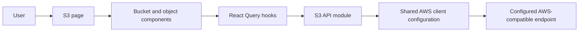

# Technical Specification: S3 Bucket Browser

## Architecture Overview

Implement S3 as a feature module following the existing AWS service, React Query, settings, and project-owned UI patterns used by the SQS and Lambda features. Replace the current S3 placeholder page with a bucket list and a bucket-contents view.



## Project Structure

```text
src/
├── features/s3/
│   ├── api/s3.ts
│   ├── components/
│   │   ├── BucketList.tsx
│   │   ├── BucketContents.tsx
│   │   ├── ObjectTable.tsx
│   │   └── RefreshButton.tsx
│   ├── hooks/
│   │   ├── useBuckets.ts
│   │   ├── useBucketObjects.ts
│   │   ├── useDeleteBucket.ts
│   │   └── useDeleteObject.ts
│   ├── types/s3.ts
│   └── index.ts
└── pages/S3Page.tsx
```

Adapt names and split components according to existing project conventions; avoid adding abstractions that are not needed for this feature.

## Data Structures

### S3Bucket

```typescript
interface S3Bucket {
  name: string;
  creationDate?: Date;
}

interface S3BucketDetails extends S3Bucket {
  region: string;
  versioningStatus: 'Enabled' | 'Suspended' | 'Not enabled';
  encryptionAlgorithms: string[];
  publicAccessBlock: {
    blockPublicAcls: boolean;
    ignorePublicAcls: boolean;
    blockPublicPolicy: boolean;
    restrictPublicBuckets: boolean;
  } | null;
}
```

### S3Object

```typescript
interface S3Object {
  key: string;
  size?: number;
  lastModified?: Date;
  etag?: string;
  storageClass?: string;
}
```

### S3ObjectPage

```typescript
interface S3ObjectPage {
  objects: S3Object[];
  nextContinuationToken?: string;
  isTruncated: boolean;
}
```

## API and Service Layer

Use `@aws-sdk/client-s3` with the shared endpoint, region, and local-emulator credential configuration. Add an S3 client factory to `src/services/aws.ts` following the existing SQS and Lambda client factories; configure path-style addressing for compatible local endpoints. Always destroy created clients in a `finally` block.

| Operation           | AWS SDK command        | Input                                                        | Output         | Behavior                                                            |
| ------------------- | ---------------------- | ------------------------------------------------------------ | -------------- | ------------------------------------------------------------------- |
| `listBuckets`       | `ListBucketsCommand`   | AWS client configuration                                     | `S3Bucket[]`   | Return bucket names and creation dates; surface request errors      |
| `listBucketObjects` | `ListObjectsV2Command` | Bucket name, optional continuation token, optional page size | `S3ObjectPage` | Return object metadata and the continuation token for the next page |
| `deleteBucket`      | `DeleteBucketCommand`  | Bucket name                                                  | `void`         | Delete an empty bucket; surface errors such as `BucketNotEmpty`     |
| `deleteObject`      | `DeleteObjectCommand`  | Bucket name and exact object key                             | `void`         | Delete the selected object; surface request errors                  |
| `getBucketDetails`  | `GetBucketLocationCommand`, `GetBucketVersioningCommand`, `GetBucketEncryptionCommand`, `GetPublicAccessBlockCommand` | Bucket metadata and client configuration | `S3BucketDetails` | Read bucket creation date, region, versioning, encryption, and public-access-block settings; treat only documented missing-configuration responses as unconfigured and surface other failures |

For object listing, request a bounded page size (100 objects) and use the returned continuation token to load subsequent pages. Do not fetch object bodies. Preserve S3 keys exactly as returned; do not treat `/` as a filesystem boundary.
Bucket deletion must never automatically delete or enumerate objects for removal. S3 only permits deleting an empty bucket; if it contains objects, report the service error and leave the bucket listed. Object deletion applies only to the explicitly selected key.

## State Management

### Bucket list

- Use a React Query key that includes the active endpoint and region.
- Provide loading, empty, error, and manual refresh states.
- Refetch after a manual refresh; do not silently replace request failures with an empty list.

### Bucket objects

- Use a query key that includes the active endpoint, region, bucket name, and continuation token.
- Enable the query only when a bucket is selected.
- Load additional pages with the continuation token; provide a way to return to the previous page or bucket list.
- Invalidate or refetch when the active connection settings change.

### Delete mutations

- Implement bucket and object deletion as explicit mutations using the active endpoint and region.
- After successful object deletion, invalidate or refetch the selected bucket's object pages.
- After successful bucket deletion, invalidate or refetch the bucket list and return to it if the deleted bucket was open.
- On failure, retain the current view and surface the actual error; do not present failed deletion as success.

## UI/UX Details

### Bucket list

- Present bucket names and creation dates when available.
- Make each bucket selectable to open its contents.
- Provide a delete action with a confirmation dialog that names the bucket and states it must be empty.
- Do not automatically empty a bucket when the user confirms bucket deletion.
- Include loading, empty, error-with-retry, and refresh states.

### Bucket contents

- Identify the selected bucket and provide a back action to the bucket list.
- Display object key/name, human-readable size, and last-modified date when available.
- Provide a delete action for each object with a confirmation dialog identifying the exact key.
- Disable the relevant delete action while its mutation is in progress.
- Include loading, empty, error-with-retry, and pagination states.
- Keep long object keys readable through wrapping or truncation with an accessible way to inspect the full key.
- Use existing project-owned table, button, and feedback primitives where appropriate; maintain keyboard accessibility and responsive behavior.

### Bucket View

- Keep `View` distinct from `Open`: View displays bucket metadata and read-only configuration, while Open displays objects.
- Show creation date, resolved bucket region (`us-east-1` when the location constraint is absent), versioning status, configured default encryption algorithms, and all four public-access-block flags.
- Render absent optional encryption and public-access-block configurations as `Not configured`.
- Treat an absent versioning status as `Not enabled`.
- Surface all configuration request failures except the explicit S3 errors indicating that encryption or public-access-block configuration is absent. Do not mask unsupported API operations or other endpoint failures.
- Do not add controls that mutate bucket configuration.

## Routing

Keep the existing S3 route and implement the bucket selection/content state within `S3Page`. Add a parameterized route only if required by the established routing and navigation patterns.

| Path  | View                                        | Parameters                                             |
| ----- | ------------------------------------------- | ------------------------------------------------------ |
| `/s3` | S3 bucket list and selected bucket contents | Selected bucket and page state are managed by the page |

## Error Handling

- Display request errors through the existing feature error/notification patterns and allow retry.
- Distinguish an empty bucket or bucket list from a failed request.
- If bucket deletion fails because the bucket is not empty, explain that its objects must be deleted first; do not silently delete them.
- If object or bucket deletion fails, preserve the current data/view and show actionable error feedback.
- Preserve the selected bucket and current view when a refresh fails.

## Security and Configuration

- Use active endpoint and region settings from the existing settings context.
- Do not add permanent AWS credentials to source, build-time environment variables, or browser storage.
- Use the established dummy credential configuration for local emulators.
- Request object metadata only; do not fetch or persist object contents.

## Dependencies

- Add `@aws-sdk/client-s3` if it is not already present.
- Reuse existing React Query, settings, toast, and UI dependencies.

## Local MinStack Resource Provisioning

Provide two separate local development scripts, following the repository guidance in `AGENTS.md`:

- `scripts/create-s3-test-bucket.mjs` creates or safely reuses the example bucket in MinStack. It defaults to the local endpoint and dummy credentials and supports `AWS_ENDPOINT`, `AWS_REGION`, and `BUCKET_NAME` overrides. It must not delete an existing bucket or its contents.
- `scripts/upload-s3-test-objects.mjs` uploads deterministic sample objects into that bucket, separately from bucket creation. It uses the same local defaults and overrides and must not remove existing data.

Document and implement the scripts as development-data preparation only; they are not dashboard feature behavior or resource-operation tests. Verify each script separately against MinStack and confirm the sample bucket and object metadata appear in the dashboard.
