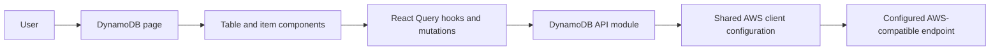

# Technical Specification: DynamoDB Management

## Architecture Overview

Implement DynamoDB as a feature module following the existing AWS client, settings, React Query, and project-owned UI patterns used by SQS, Lambda, and the planned S3 feature. Replace the DynamoDB placeholder page with paginated table browsing, table details, key queries, scans, and confirmed deletion flows.



## Project Structure

```text
src/
├── features/dynamodb/
│   ├── api/dynamodb.ts
│   ├── components/
│   │   ├── TableList.tsx
│   │   ├── TableDetails.tsx
│   │   ├── ItemResults.tsx
│   │   ├── ItemQueryForm.tsx
│   │   ├── ScanForm.tsx
│   │   └── DeleteConfirmDialog.tsx
│   ├── hooks/
│   │   ├── useTables.ts
│   │   ├── useTableDetails.ts
│   │   ├── useQueryItems.ts
│   │   ├── useScanItems.ts
│   │   ├── useDeleteItem.ts
│   │   └── useDeleteTable.ts
│   ├── types/dynamodb.ts
│   └── index.ts
└── pages/DynamoDbPage.tsx
```

Adapt file names and component boundaries to existing project conventions; do not add abstractions that are not needed by the feature.

## Data Structures

Use the DynamoDB Document Client representation so items retain DynamoDB scalar and nested document types as normal JavaScript values.

### DynamoTableSummary

```typescript
interface DynamoTableSummary {
  tableName: string;
  tableStatus?: string;
  itemCount?: number;
  tableSizeBytes?: number;
  creationDateTime?: Date;
}
```

### DynamoKeyAttribute

```typescript
type DynamoScalarType = 'S' | 'N' | 'B';
type DynamoKeyValue = string | number | Uint8Array;

interface DynamoKeyAttribute {
  attributeName: string;
  attributeType: DynamoScalarType;
  keyType: 'HASH' | 'RANGE';
}
```

### DynamoTableDetails

```typescript
interface DynamoTableDetails extends DynamoTableSummary {
  keySchema: DynamoKeyAttribute[];
  secondaryIndexes: DynamoSecondaryIndex[];
}

interface DynamoSecondaryIndex {
  indexName: string;
  indexType: 'GLOBAL' | 'LOCAL';
  indexStatus?: string;
  keySchema: DynamoKeyAttribute[];
}
```

### ItemPage

```typescript
type DynamoItem = Record<string, unknown>;
type DynamoKey = Record<string, string | number | Uint8Array>;

interface ItemPage {
  items: DynamoItem[];
  lastEvaluatedKey?: DynamoKey;
  scannedCount?: number;
}
```

### ItemSearch

```typescript
type SortKeyCondition =
  | { operator: 'EQ' | 'LT' | 'LE' | 'GT' | 'GE'; value: DynamoKeyValue }
  | { operator: 'BETWEEN'; value: [DynamoKeyValue, DynamoKeyValue] }
  | { operator: 'BEGINS_WITH'; value: string | Uint8Array };

interface ItemQuery {
  tableName: string;
  partitionKeyValue: DynamoKeyValue;
  sortKeyCondition?: SortKeyCondition;
  exclusiveStartKey?: DynamoKey;
}

interface ItemScan {
  tableName: string;
  exclusiveStartKey?: DynamoKey;
}
```

For binary key values, accept base64 text in the UI and convert it to/from `Uint8Array` at the API boundary. Parse numeric key values as finite numbers; keep string key values unchanged.

## API and Service Layer

Use `@aws-sdk/client-dynamodb` for table-management commands and `@aws-sdk/lib-dynamodb` with a `DynamoDBDocumentClient` for item Query, Scan, and Delete commands. Add a shared DynamoDB client factory to `src/services/aws.ts` following the existing SQS and Lambda factories; create the Document Client from that configured low-level client where needed. Pass active endpoint and region settings to every API operation, and destroy the underlying low-level client in a `finally` block.

Use bounded request sizes (100 tables or items per page where supported, using `Limit` for Query and Scan). Return DynamoDB's continuation key and request further pages only when the user requests them. Do not automatically fetch every page.

Map key attribute types from the `AttributeDefinitions` returned by `DescribeTable`. When using `DynamoDBDocumentClient`, pass native JavaScript values in `ExpressionAttributeValues` (strings, finite numbers, or `Uint8Array` for binary keys); do not pass low-level DynamoDB `AttributeValue` wrappers such as `{ S: "value" }`.

| Operation       | AWS SDK command        | Input                                                                                | Output                                   | Behavior                                                                   |
| --------------- | ---------------------- | ------------------------------------------------------------------------------------ | ---------------------------------------- | -------------------------------------------------------------------------- |
| `listTables`    | `ListTablesCommand`    | `Limit: 100` and optional `ExclusiveStartTableName`                                  | Table names and `LastEvaluatedTableName` | Return one bounded page of table names                                     |
| `describeTable` | `DescribeTableCommand` | Table name                                                                           | `DynamoTableDetails`                     | Map table summary and key schema; surface missing-table and service errors |
| `queryItems`    | `QueryCommand`         | Table name, partition key value, optional sort-key condition and `ExclusiveStartKey` | `ItemPage`                               | Query by the primary key; use expression attribute names/values safely     |
| `scanItems`     | `ScanCommand`          | Table name and optional `ExclusiveStartKey`                                          | `ItemPage`                               | Scan one bounded page without silently fetching the rest of the table      |
| `deleteItem`    | `DeleteCommand`        | Table name and full primary key                                                      | `void`                                   | Delete exactly the item identified by its partition and optional sort key  |
| `deleteTable`   | `DeleteTableCommand`   | Table name                                                                           | Deletion status                          | Delete the table and all its data after explicit confirmation              |

### Query behavior

- Read partition and sort key names/types from `DescribeTable`; do not hard-code table key names.
- Require a partition key value. When the table has a sort key, allow it to be omitted or use a supported condition: `EQ`, `LT`, `LE`, `GT`, `GE`, `BETWEEN`, or `BEGINS_WITH`.
- Validate values according to the key type and reject unsupported key condition/type combinations with a user-visible validation error. Encode/decode binary keys as base64 in the UI.
- Use expression attribute names and values rather than interpolating user-provided names or values into expressions.
- Reject missing or incomplete key schema information instead of silently assuming key types.

### Scan behavior

- Start with an unfiltered scan and return one bounded page; a scan is a distinct user-selected mode, not a fallback for an empty query.
- Continue using `LastEvaluatedKey` only on explicit user action.
- Do not add arbitrary scan filters in this feature's first version.

### Deletion behavior

- For item deletion, derive and submit the complete key from the table key schema and selected item. Do not offer deletion if the complete primary key cannot be determined.
- Table deletion permanently removes the table and its items. The confirmation must make this consequence explicit.
- Do not automatically retry destructive mutations.

## State Management

### Table list

- Use React Query keys that include active endpoint and region, plus the current pagination cursor.
- Support manual refresh and paginated navigation.
- Keep table list errors separate from empty results.

### Table details and item results

- Include endpoint, region, table name, search mode, normalized key conditions, and pagination cursor in query keys.
- Load table details when a table is selected.
- Keep Query and Scan modes explicit and separate; changing mode or criteria resets the item pagination cursor.
- Support loading the next page only when the returned continuation key exists.

### Delete mutations

- Use dedicated item and table mutations with the active endpoint and region.
- On item deletion success, invalidate/refetch the current table's item results and update the displayed data.
- On table deletion success, invalidate/refetch the table list and return to it if the deleted table was open.
- On failure, retain the current view and show the actual error; do not present failed deletion as success.

## UI/UX Details

### Page Title

- Display `Tables` as the main title for the table list.
- Keep `DynamoDB` as the service/category label; do not use `aws local DynamoDB` as the main page title.

### Table list

- Display table name and available status, item-count, size, and creation-date metadata.
- Support table-list pagination, refresh, loading, empty, and retryable error states.
- Provide separate `View`, `Items`, and `Delete` actions.

### View: table details

- Show the table name, status, creation date, size, and item count when available.
- Show the selected table's partition key and optional sort key with their DynamoDB types.
- List global and local secondary indexes reported by `DescribeTable`, including each index name, kind, status when available, and key schema/types.
- Show an explicit empty state when the table has no secondary indexes.

### Items: item browser

- Treat `Items` as the records stored in the selected table; do not use it as a synonym for table metadata.
- Offer clearly labeled `Query by key` and `Scan table` modes.
- In Query mode, collect required partition-key values and optional supported sort-key conditions using inputs appropriate to the key type.
- In Scan mode, clearly warn that it reads table items, and provide an explicit control to start and load more pages.
- Render item values as readable structured JSON without losing nested types; render binary values as base64 and preserve enough item/key data for exact item deletion.
- Provide an item delete action with a confirmation dialog identifying the table and full primary key.
- Include loading, empty, error-with-retry, and paginated-result states.
- Provide a return action to the table list and handle table deletion while its detail view is open.

### Destructive confirmations

- Item confirmation identifies the table and complete item key and states that deletion cannot be undone.
- Table confirmation identifies the table and states that deleting it also permanently deletes every item in it.
- Require an explicit destructive confirmation action; disable it while the request is in progress.

Use existing project-owned dialog, button, table, and notification primitives. Ensure keyboard navigation, accessible labels, responsive layout, and visible focus states.

## Routing

Keep the existing DynamoDB route and manage the selected table and item search state within `DynamoDbPage`, unless existing routing patterns call for a parameterized detail route.

| Path        | View                                                 | Parameters                                            |
| ----------- | ---------------------------------------------------- | ----------------------------------------------------- |
| `/dynamodb` | DynamoDB table list and selected table details/items | Selected table, query/scan mode, and pagination state |

## Error Handling

- Distinguish empty table lists, tables with no matching items, and failed requests.
- Show actionable errors for missing tables, invalid key values, and AWS-compatible service failures.
- Explain that scans may require multiple pages and only show results returned so far.
- If a delete fails, preserve the table/item view and report the failure.
- Do not convert exceptions to empty arrays or success-shaped results.

## Security and Configuration

- Use the active endpoint and region from the existing settings context.
- Do not add permanent AWS credentials to source, build-time environment variables, or browser storage.
- Follow the established local-emulator credential configuration.
- Avoid logging item contents or key values.
- Do not execute scans, queries, or destructive operations without explicit user actions.

## Local MinStack Resource Provisioning

- Add `scripts/create-dynamodb-test-table.mjs` to create a DynamoDB table in the local MinStack emulator, and `scripts/put-dynamodb-test-items.mjs` as a separate helper to add deterministic sample items to that table. Do not combine table creation and item insertion in one helper.
- Both scripts default to `http://localhost:4566` and dummy credentials (`test`/`test`); allow `AWS_ENDPOINT`, `AWS_REGION`, and `TABLE_NAME` overrides for another local emulator or resource name.
- The table-creation script creates a table with a partition key and sort key and waits until it is active. The item-insertion script adds a small, deterministic set of items suitable for the key Query and Scan views.
- Make repeated runs safe: table creation reuses an existing table, and item insertion upserts the sample items without deleting existing resources.
- Keep these helpers separate from the dashboard's out-of-scope table/item creation UI. The UI remains read/query/scan/delete only; the scripts prepare local emulator data and do not exercise or validate dashboard UI operations.
- Never use these helpers with real AWS credentials or production endpoints.

## Dependencies

- Add `@aws-sdk/client-dynamodb` and `@aws-sdk/lib-dynamodb` if not already installed.
- Reuse existing React Query, settings, toast, and project UI dependencies.
