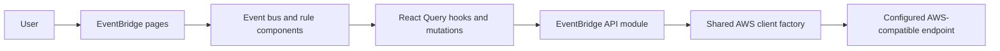

# Technical Specification: EventBridge EventBus Management

## Architecture Overview

Implement EventBridge EventBus management as a feature module that follows the existing AWS client, settings, React Query, and project-owned UI patterns used by SQS, Lambda, S3, and DynamoDB. Enable the existing disabled EventBridge sidebar entry and replace the placeholder with a paginated event bus list, a parameterized detail view with read-only rules and targets, policy display, and confirmed deletion of custom event buses. Event bus creation and rule management are out of scope.



## Project Structure

```text
src/
├── features/eventbridge/
│   ├── api/eventbridge.ts
│   ├── components/
│   │   ├── EventBusTable.tsx
│   │   ├── EventBusDetails.tsx
│   │   ├── EventBusPolicyDisplay.tsx
│   │   ├── RuleList.tsx
│   │   └── DeleteEventBusDialog.tsx
│   ├── hooks/
│   │   ├── useEventBuses.ts
│   │   ├── useEventBusDetails.ts
│   │   ├── useEventBusRules.ts
│   │   └── useDeleteEventBus.ts
│   ├── types/eventbridge.ts
│   └── index.ts
└── pages/
    ├── EventBusesPage.tsx
    └── EventBusDetailPage.tsx
```

Adapt component boundaries only if the feature does not need them; do not add abstractions the feature does not use.

## Data Structures

Map AWS SDK response shapes to camelCase domain types at the API boundary; do not leak raw SDK PascalCase objects into components.

### EventBusSummary

```typescript
interface EventBusSummary {
  name: string;
  arn: string;
  description?: string;
  policy?: string; // JSON string
  createdAt?: Date;
}
```

### EventBusDetail

```typescript
interface EventBusDetail extends EventBusSummary {
  rules: EventBridgeRule[];
  rulesNextToken?: string;
}

interface EventBridgeRule {
  name: string;
  arn: string;
  eventBusName: string;
  state: 'ENABLED' | 'DISABLED';
  description?: string;
  eventPattern?: string; // JSON string
  roleArn?: string;
  managedBy?: string;
  targets: RuleTarget[];
}

interface RuleTarget {
  id: string;
  arn: string;
  roleArn?: string;
  input?: string;
  inputPath?: string;
}
```

### Pagination

```typescript
interface EventBusPage {
  eventBuses: EventBusSummary[];
  nextToken?: string;
}

interface RulePage {
  rules: EventBridgeRule[];
  nextToken?: string;
}
```

`DescribeEventBus` does not reliably return creation time or description, so merge list metadata (from `ListEventBuses`) with the describe result when building `EventBusDetails`.

## API and Service Layer

Add `createEventBridgeClient(config?: AwsClientConfig)` to `src/services/aws.ts` following the existing SQS, Lambda, S3, and DynamoDB factories. Use `@aws-sdk/client-eventbridge`, pass the active endpoint and region settings to every operation, and destroy the underlying client in a `finally` block.

Use bounded request sizes (`Limit: 100`) and return AWS continuation tokens instead of fetching every page automatically. Do not auto-paginate.

| Operation | AWS SDK command | Input | Output | Behavior |
| --- | --- | --- | --- | --- |
| `listEventBuses` | `ListEventBusesCommand` | optional `NextToken`, `Limit: 100` | `EventBusPage` | Return one bounded page of event buses |
| `getEventBusDetails` | `DescribeEventBusCommand` | `Name` | `EventBusDetails` (without rules) | Map name, ARN, and policy; surface missing-bus and service errors |
| `listRules` | `ListRulesCommand` | `EventBusName`, optional `NextToken`, `Limit: 100` | `RulePage` | Read-only list of rules for a bus |
| `listTargetsByRule` | `ListTargetsByRuleCommand` | `Rule`, `EventBusName` | `RuleTarget[]` | Read-only targets for a rule (bounded) |
| `deleteEventBus` | `DeleteEventBusCommand` | `Name` | `void` | Delete a custom event bus after explicit confirmation |

### Behavior notes

- The `default` event bus cannot be deleted. The API layer must reject deletion of `default`, and the UI must not offer the action for it.
- Deletion removes the bus and all rules/targets attached to it. Do not automatically retry destructive mutations.
- Do not convert thrown errors into empty arrays or success-shaped results.

## State Management

### Event bus list

- Query key includes the active endpoint, region, and pagination cursor: `['eventbridge', 'eventbuses', endpoint, region, nextToken]`.
- Support manual refresh and paginated navigation (next/previous using `NextToken`).
- Keep list errors separate from an empty result.

### Event bus details and rules

- Query key: `['eventbridge', 'eventbus', endpoint, region, name]` for metadata and policy.
- Query key: `['eventbridge', 'eventbus', endpoint, region, name, 'rules', nextToken]` for rules.
- Targets keyed per rule: `['eventbridge', 'eventbus', endpoint, region, name, 'targets', ruleName]`.
- Load details when the detail route is opened; keep rules and targets read-only.
- Support loading further rule pages only when a continuation token exists.

### Delete mutation

- Dedicated `useDeleteEventBus` mutation including the active endpoint and region.
- On success, invalidate/refetch the event bus list and navigate back to it.
- On failure, keep the current view and show the real error.

## UI/UX Details

### Page title

- Category label (uppercase, small): `EventBridge`.
- Main title (large): `Event Buses`.
- Right side: `RefreshButton`.

### Event bus list

- Table columns: name, ARN, creation date (formatted), and actions.
- Actions per `docs/ui-patterns.md`: `View` (secondary) and `Delete` (destructive). Do not show `Delete` for the `default` bus.
- Loading (skeleton), empty, and retryable error states.
- Pagination controls using `NextToken` when more results exist.

### Event bus detail (`View`)

- Back button returning to the list; header with the bus name and the `EventBridge` label.
- Metadata: name, ARN, description (when present), and creation date (when available).
- Policy: render formatted JSON when parseable; otherwise display the raw string with a warning. Hide the section when no policy exists.
- Rules: read-only list showing rule name, state (`Badge` ENABLED/DISABLED), event pattern, description, and targets. Show an explicit empty state when there are no rules. Support loading additional rule pages when a continuation token exists.
- Targets per rule: id, ARN, and role ARN when present.

### Destructive confirmation

- The delete dialog identifies the bus and warns that the bus and all of its rules are permanently removed.
- Require an explicit destructive confirmation action; disable it while the request is in progress.

Reuse project-owned dialog, button, table, badge, and notification primitives. Ensure keyboard navigation, accessible labels, responsive layout, and visible focus states. For JSON policy/pattern display, add a small project-owned read-only `CodeBlock` primitive in `src/components/ui/` if no existing primitive suffices; do not add third-party viewer dependencies.

## Routing

| Path | View | Parameters |
| --- | --- | --- |
| `/eventbridge/eventbuses` | `EventBusesPage` (list) | list pagination state |
| `/eventbridge/eventbuses/:name` | `EventBusDetailPage` (detail) | `name` |

Register routes in `src/routes.ts` following the existing Lambda detail pattern. Update the sidebar entry in `src/config/navigation.ts` to point to `/eventbridge/eventbuses` and remove the `comingSoon`/`disabled` flags for EventBridge EventBus. Leave the EventBridge Scheduler entry for [feature 010](../010-eventbridge-scheduler-management/spec.md), which enables it.

## Error Handling

- Empty event bus list vs. failed request: show distinct empty and error states.
- Missing event bus on the detail route: show a not-found state with a link back to the list instead of crashing.
- Deletion of the `default` bus: reject in the API layer and hide the action in the UI.
- Invalid policy/pattern JSON: display the raw string with a warning rather than failing to render.
- Request failures: toast notification plus retry.
- Do not convert exceptions into empty arrays or success-shaped results.

## Security and Configuration

- Use the active endpoint and region from the existing settings context.
- Do not add permanent AWS credentials to source, build-time environment variables, or browser storage; follow the established local-emulator dummy credential configuration.
- Avoid logging policy contents.
- Perform deletion only on explicit user action.

## Local MinStack Resource Provisioning

- Add `scripts/create-eventbridge-eventbus.mjs` to create a custom event bus in the local MinStack emulator, and `scripts/eventbridge-test-data.mjs` as a separate helper to add deterministic sample rules and targets to that bus. Do not combine bus creation and sample-data insertion in one helper.
- Both scripts default to `http://localhost:4566` and dummy credentials (`test`/`test`); allow `AWS_ENDPOINT`, `AWS_REGION`, and `EVENT_BUS_NAME` overrides.
- The bus-creation script reuses an existing bus instead of failing or deleting it. The sample-data script upserts a small deterministic set of event-pattern rules (including at least one enabled and one disabled rule) and targets without deleting existing resources. Do not create schedule-based rules; scheduled triggers belong to EventBridge Scheduler (feature 010).
- Target ARNs may reference the local SQS queue or Lambda function created by the existing `scripts/` helpers; use a local ARN or placeholder role ARN suitable for the emulator.
- These helpers prepare local emulator data only and are distinct from unit tests and browser validation. Never use them with real AWS credentials or production endpoints.

## Dependencies

- Add `@aws-sdk/client-eventbridge` (not currently installed).
- Reuse existing React Query, settings, toast, and project UI dependencies.