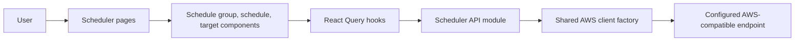

# Technical Specification: EventBridge Scheduler Management

## Architecture Overview

Implement EventBridge Scheduler management as a feature module that follows the
existing AWS client, settings, React Query, and project-owned UI patterns used by
SQS, Lambda, S3, DynamoDB, and EventBridge EventBus. Enable the existing disabled
EventBridge Scheduler sidebar entry and replace the placeholder with a paginated
schedule group list, a schedule group detail view, a schedule list per group, and
a schedule detail view. This iteration is read-only.

EventBridge Scheduler has its own SDK client (`@aws-sdk/client-scheduler`) and API
namespace, so it lives in a nested `scheduler/` module inside the existing
EventBridge feature (`src/features/eventbridge/scheduler/`), alongside the
EventBus module, and stays grouped under the EventBridge entry in the sidebar and
the `/eventbridge/scheduler` route prefix.



## Project Structure

```text
src/
├── features/eventbridge/
│   ├── api/eventbridge.ts
│   ├── components/
│   ├── hooks/
│   ├── types/eventbridge.ts
│   ├── scheduler/
│   │   ├── api/scheduler.ts
│   │   ├── components/
│   │   │   ├── ScheduleGroupTable.tsx
│   │   │   ├── ScheduleGroupDetails.tsx
│   │   │   ├── ScheduleTable.tsx
│   │   │   ├── ScheduleTargetDisplay.tsx
│   │   │   └── ScheduleExpressionDisplay.tsx
│   │   ├── hooks/
│   │   │   ├── useScheduleGroups.ts
│   │   │   ├── useScheduleGroupDetails.ts
│   │   │   ├── useSchedules.ts
│   │   │   └── useScheduleDetails.ts
│   │   ├── lib/scheduleExpression.ts
│   │   ├── types/scheduler.ts
│   │   └── index.ts
│   └── index.ts
└── pages/
    ├── SchedulerGroupsPage.tsx
    ├── SchedulerGroupDetailPage.tsx
    ├── SchedulerSchedulesPage.tsx
    └── SchedulerScheduleDetailPage.tsx
```

Add component boundaries only if the feature needs them; do not introduce
abstractions the feature does not use.

## Data Structures

Map AWS SDK response shapes to camelCase domain types at the API boundary; do not
leak raw SDK PascalCase objects into components.

```typescript
type ScheduleState = 'ENABLED' | 'DISABLED';

interface ScheduleGroupSummary {
  name: string;
  arn: string;
  createdAt?: Date;
  lastModifiedAt?: Date;
}

// GetScheduleGroup returns the same fields as the list summary.
type ScheduleGroupDetails = ScheduleGroupSummary;

interface ScheduleGroupPage {
  scheduleGroups: ScheduleGroupSummary[];
  nextToken?: string;
}

interface ScheduleSummary {
  name: string;
  arn: string;
  groupName: string;
  state: ScheduleState;
  createdAt?: Date;
  lastModifiedAt?: Date;
  targetArn?: string;
}

interface SchedulePage {
  schedules: ScheduleSummary[];
  nextToken?: string;
}

interface ScheduleTarget {
  arn: string;
  roleArn?: string;
  input?: string;
  retryPolicy?: {
    maximumEventAgeInSeconds?: number;
    maximumRetryAttempts?: number;
  };
  deadLetterConfig?: { arn?: string };
  // Target-type specific parameters, rendered only when present.
  sqsParameters?: { messageGroupId?: string };
  eventBridgeParameters?: { detailType?: string; source?: string };
  kinesisParameters?: { partitionKey?: string };
  ecsParameters?: Record<string, unknown>;
  sageMakerPipelineParameters?: Record<string, unknown>;
}

interface ScheduleDetails extends ScheduleSummary {
  description?: string;
  scheduleExpression?: string;
  scheduleExpressionTimezone?: string;
  startDate?: Date;
  endDate?: Date;
  actionAfterCompletion?: 'NONE' | 'DELETE';
  kmsKeyArn?: string;
  flexibleTimeWindow?: {
    mode: 'OFF' | 'FLEXIBLE';
    maximumWindowInMinutes?: number;
  };
  target?: ScheduleTarget;
}
```

`ListScheduleGroups` and `ListSchedules` return summaries only. Schedule
expressions, target configuration, and description are only available through
`GetSchedule`, so the schedule list must not promise fields it does not have.

## API and Service Layer

Add `createSchedulerClient(config?: AwsClientConfig)` to `src/services/aws.ts`
following the existing SQS, Lambda, S3, DynamoDB, and EventBridge factories. Use
`@aws-sdk/client-scheduler`, pass the active endpoint and region settings to every
operation, and destroy the underlying client in a `finally` block.

EventBridge Scheduler exposes a REST/JSON API (for example `GET /schedule-groups`,
`GET /schedule-groups/{Name}`, `GET /schedules`, `GET /schedules/{Name}`). The AWS
SDK handles the request shape; do not hand-roll the older `Action=` query protocol
used by other EventBridge APIs.

Use bounded request sizes (`MaxResults: 100`) and return AWS continuation tokens
instead of fetching every page automatically. Do not auto-paginate.

| Operation | AWS SDK command | Input | Output | Behavior |
| --- | --- | --- | --- | --- |
| `listScheduleGroups` | `ListScheduleGroupsCommand` | optional `NextToken`, `MaxResults: 100` | `ScheduleGroupPage` | Return one bounded page of schedule groups |
| `getScheduleGroupDetails` | `GetScheduleGroupCommand` | `Name` | `ScheduleGroupDetails` | Map name, ARN, creation and last modification dates; surface not-found and service errors |
| `listSchedules` | `ListSchedulesCommand` | `GroupName`, optional `State`, optional `NextToken`, `MaxResults: 100` | `SchedulePage` | Return one bounded page of schedules, optionally filtered by state |
| `getScheduleDetails` | `GetScheduleCommand` | `Name`, `GroupName` | `ScheduleDetails` | Map metadata, expression, flexible time window, and target configuration |

### Behavior notes

- Do not convert thrown errors into empty arrays or success-shaped results.
- The API layer is read-only: it must not expose create, update, delete, or run
  operations in this iteration.
- The `default` schedule group always exists; the UI treats it like any other group.

## State Management

### Schedule group list

- Query key includes the active endpoint, region, and pagination cursor:
  `['scheduler', 'schedulegroups', endpoint, region, nextToken]`.
- Support manual refresh and paginated navigation (previous/next using `NextToken`).
- Keep list errors separate from an empty result.

### Schedule group details

- Query key: `['scheduler', 'schedulegroup', endpoint, region, name]`.

### Schedules within a group

- Query key: `['scheduler', 'schedules', endpoint, region, groupName, state, nextToken]`.
- The `state` filter (`all` → omit, or `ENABLED`/`DISABLED`) is part of the key so
  filtering re-uses the bounded server-side query.

### Schedule details

- Query key: `['scheduler', 'schedule', endpoint, region, groupName, name]`.

## UI/UX Details

### Page title

- Category label (uppercase, small): `EventBridge Scheduler`.
- Main title (large): `Schedule Groups`.
- Right side: refresh action, consistent with existing list pages.

### Schedule group list

- Table columns: name, ARN, creation date (formatted), and actions.
- Actions per `docs/ui-patterns.md`: `View` (`Info` icon, label
  `View details for {name}`) opens the schedule group detail, and `Schedules`
  (`Table` icon, label `View schedules in {name}`) opens the group's schedule
  list at `/eventbridge/scheduler/groups/:groupName/schedules`. The two actions
  must lead to different destinations.
- No `Delete` action in this iteration (read-only scope).
- Loading (skeleton), empty, and retryable error states.
- Pagination controls using `NextToken` when more results exist.

### Schedule group detail (`View`)

- Back button returning to the schedule group list; header with the group name and
  the `EventBridge Scheduler` label.
- Metadata: name, ARN, creation date, last modification date.
- An action that opens the group's schedule list.

### Schedules list

- Header shows the group name; back button returns to the schedule group detail.
- State filter control (all / enabled / disabled) driving the server-side filter.
- Table columns: name, state (`Badge` ENABLED/DISABLED), target ARN, last
  modification date, and a `View` action that opens the schedule detail. The list
  API returns summaries only, so the schedule expression is shown on the detail
  view rather than in the list.
- Loading (skeleton), explicit empty state, and retryable error states.
- Pagination controls using `NextToken` when more results exist.

### Schedule detail (`View`)

- Back button returning to the group's schedule list; header with the schedule name
  and the `EventBridge Scheduler` label.
- Metadata: name, ARN, group name, description (when present), schedule expression
  with timezone, state badge, start/end dates (when present), flexible time window,
  and action after completion.
- Target section: target ARN, role ARN, input payload, retry policy, dead-letter
  queue, and target-specific parameters when present. Render the input payload with
  the project-owned `CodeBlock`; display raw text with a warning when it is not
  parseable JSON.
- Do not render next or last invocation times; the API does not provide them.

### Schedule expression display

- Show the raw expression and a best-effort human-readable description for common
  forms (`rate(5 minutes)` → "Every 5 minutes"; `cron(...)` → described schedule),
  always alongside the raw expression and the timezone when present.
- Keep the formatting helper feature-local in `src/features/eventbridge/scheduler/lib/` because
  no shared utility exists; do not add a third-party cron/rate library.

Reuse project-owned table, card, badge, code block, skeleton, dialog, button, and
notification primitives. Ensure keyboard navigation, accessible labels, responsive
layout, and visible focus states.

## Routing

| Path | View | Parameters |
| --- | --- | --- |
| `/eventbridge/scheduler/groups` | `SchedulerGroupsPage` (list) | list pagination state |
| `/eventbridge/scheduler/groups/:groupName` | `SchedulerGroupDetailPage` (group detail) | `groupName` |
| `/eventbridge/scheduler/groups/:groupName/schedules` | `SchedulerSchedulesPage` (schedules list) | `groupName`, state filter, list pagination state |
| `/eventbridge/scheduler/groups/:groupName/schedules/:scheduleName` | `SchedulerScheduleDetailPage` (schedule detail) | `groupName`, `scheduleName` |

Register the routes in `src/routes.ts` following the existing Lambda and EventBus
detail patterns. Update the existing `EventBridge (Scheduler)` entry in
`src/config/navigation.ts` to point to `/eventbridge/scheduler/groups` and remove
its `comingSoon`/`disabled` flags; do not add a second navigation entry.

## Error Handling

- Empty schedule group or schedule list vs. failed request: show distinct empty and
  error states.
- Missing schedule group or schedule on a detail route: show a not-found state with
  a link back to the parent list instead of crashing.
- Request failures: toast notification plus retry.
- Do not convert exceptions into empty arrays or success-shaped results.

## Security and Configuration

- Use the active endpoint and region from the existing settings context.
- Do not add permanent AWS credentials to source, build-time environment variables,
  or browser storage; follow the established local-emulator dummy credential
  configuration.
- Avoid logging target input payloads.
- The feature is read-only and performs no destructive operations.

## Local MinStack Resource Provisioning

- Add `scripts/create-scheduler-schedule-group.mjs` to create a custom schedule
  group in the local MinStack emulator, and `scripts/scheduler-test-data.mjs` as a
  separate helper to add deterministic sample schedules to that group. Do not
  combine group creation and sample-data insertion in one helper.
- Both scripts default to `http://localhost:4566` and dummy credentials
  (`test`/`test`); allow `AWS_ENDPOINT`, `AWS_REGION`, and `SCHEDULE_GROUP_NAME`
  overrides.
- The group-creation script reuses an existing group instead of failing or deleting
  it. The sample-data script upserts a small deterministic set of schedules,
  including at least one enabled and one disabled schedule, without deleting
  existing resources.
- Each schedule must set a `ScheduleExpression` (for example `rate(5 minutes)`), a
  target with a role ARN, and a flexible time window with mode `OFF` (required by
  the API). A placeholder role ARN and a local target ARN referencing resources
  created by the existing `scripts/` helpers are suitable for the emulator.
- These helpers prepare local emulator data only and are distinct from unit tests
  and browser validation. Never use them with real AWS credentials or production
  endpoints.

## Dependencies

- Add `@aws-sdk/client-scheduler` (not currently installed).
- Reuse existing React Query, settings, toast, and project UI dependencies.
