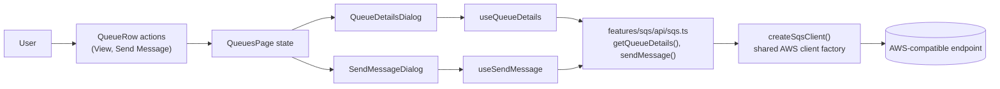
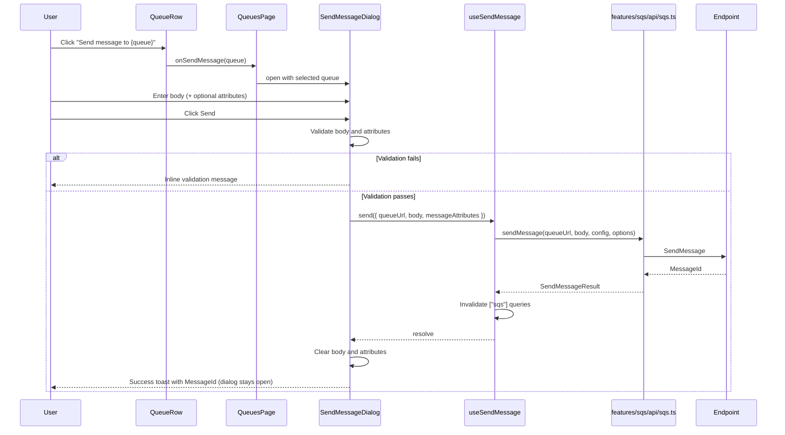
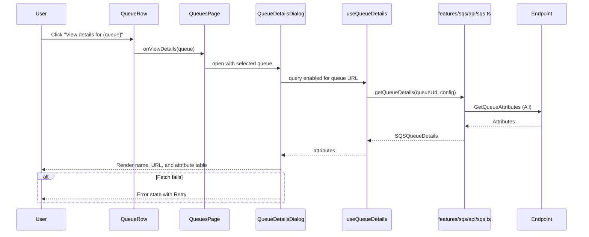

# Technical Specification: SQS Queue Messaging and Details

## Architecture Overview

The feature extends the existing SQS feature module and reuses the established layering: a page-level component owns dialog state, feature components own presentation (and, for sending, form validation), React Query hooks own the request lifecycle (a mutation for sending and a query for details), and the SQS API module calls the AWS SDK through the shared client factory.







## Project Structure

```text
src/
├── features/sqs/
│   ├── api/
│   │   └── sqs.ts                     # Add sendMessage() + getQueueDetails()
│   ├── components/
│   │   ├── QueueRow.tsx               # Add View details + Send Message actions
│   │   ├── QueueTable.tsx             # Pass through onViewDetails + onSendMessage
│   │   ├── QueueDetailsDialog.tsx     # New dialog: queue attributes
│   │   ├── SendMessageDialog.tsx      # New dialog: body + attributes
│   │   └── index.ts                   # Export new dialogs
│   ├── hooks/
│   │   ├── useQueueDetails.ts         # New details query hook
│   │   ├── useSendMessage.ts          # New mutation hook
│   │   └── index.ts                   # Export new hooks
│   └── types/
│       └── sqs.ts                     # Add SendMessage and QueueDetails types
├── pages/
│   └── QueuesPage.tsx                 # Dialog state + toast handling
tests/features/sqs/
├── api/sqs.test.ts                    # Add sendMessage + getQueueDetails unit tests
├── hooks/sqs-hooks.test.tsx           # Hook tests
└── components/sqs-components.test.tsx # New component tests
```

## Data Structures

### SendMessageOptions

```typescript
interface SendMessageOptions {
  messageAttributes?: Record<string, { dataType: 'String'; stringValue: string }>;
  delaySeconds?: number;
}
```

### SendMessageResult

```typescript
interface SendMessageResult {
  messageId: string;
  md5OfMessageBody?: string;
  md5OfMessageAttributes?: string;
}
```

### SendMessageDialogProps

```typescript
interface SendMessagePayload {
  queueUrl: string;
  body: string;
  messageAttributes?: Record<string, { dataType: 'String'; stringValue: string }>;
}

interface SendMessageDialogProps {
  open: boolean;
  onOpenChange: (open: boolean) => void;
  queue: SQSQueue | null;
  onSend: (payload: SendMessagePayload) => Promise<void>;
  pending: boolean;
}
```

### SQSQueueDetails

```typescript
interface SQSQueueDetails {
  url: string;
  name: string;
  attributes: Record<string, string>;
}
```

`attributes` holds every entry returned by `GetQueueAttributes` (`AttributeNames: All`). Keys are the raw SQS attribute names (for example `QueueArn`, `CreatedTimestamp`, `RedrivePolicy`).

### QueueDetailsDialogProps

```typescript
interface QueueDetailsDialogProps {
  open: boolean;
  onOpenChange: (open: boolean) => void;
  queue: SQSQueue | null;
}
```

## API and Service Layer

| Operation | Service or API | Input | Output | Behavior |
|-----------|----------------|-------|--------|----------|
| `sendMessage` | `features/sqs/api/sqs.ts` → `SendMessageCommand` | `queueUrl: string`, `body: string`, `config?: AwsClientConfig`, `options?: SendMessageOptions` | `Promise<SendMessageResult>` | Creates a client via `createSqsClient(config)`, sends the message, maps `MessageId`/`MD5OfMessageBody`/`MD5OfMessageAttributes`, and always destroys the client in a `finally` block |
| `getQueueDetails` | `features/sqs/api/sqs.ts` → `GetQueueAttributesCommand` | `queueUrl: string`, `config?: AwsClientConfig` | `Promise<SQSQueueDetails>` | Creates a client via `createSqsClient(config)`, requests `AttributeNames: ['All']`, returns the queue name (derived from the URL) and the raw attribute map, and always destroys the client in a `finally` block |
| `useSendMessage` | `features/sqs/hooks/useSendMessage.ts` | `{ queueUrl, body, messageAttributes? }` | `{ send, pending, error }` | Wraps `sendMessage` in `useMutation` using endpoint/region from `useSettings`, invalidating the `['sqs']` query family on success |
| `useQueueDetails` | `features/sqs/hooks/useQueueDetails.ts` | `queueUrl: string \| null`, `enabled = true` | `{ details, loading, error, refetch }` | `useQuery` keyed by endpoint, region, and queue URL; enabled only when a queue URL is provided and `enabled` is true |

Notes:

- `sendMessage` and `getQueueDetails` follow the existing create-client → call → destroy pattern and reuse `createSqsClient`, so the local-endpoint `x-amzn-query-mode` header middleware applies.
- The SQS client factory already injects dummy credentials and the configured endpoint/region; no new configuration is required.
- Only string message attributes are supported (`DataType: 'String'`, `StringValue`). SQS allows at most 10 message attributes; the UI does not need to enforce this beyond the validation rules below.
- `getQueueDetails` requests attributes only; queue tags are out of scope.

## State Management

### useSendMessage

- Mutation function: `sendMessage(queueUrl, body, config, options)`.
- Query key impact: on success, `queryClient.invalidateQueries({ queryKey: ['sqs'] })` so the queue list counts and any open message view refresh.
- Returned shape mirrors `usePurgeQueue`: `{ send: mutation.mutateAsync, pending: mutation.isPending, error: mutation.error }`.

### useQueueDetails

- Query key: `['sqs', 'details', endpoint, region, queueUrl]`.
- Enabled only when `queueUrl` is provided and `enabled` is true (the dialog passes its `open` state).
- Stale time: 30 seconds. Fetches fresh data each time the dialog is opened after the stale window; the dialog exposes a manual `refetch`.
- Returns `{ details, loading, error, refetch }`.

### QueuesPage dialog state

- `sendDialogOpen: boolean` / `queueForSend: SQSQueue | null` — send dialog visibility and the queue selected by the row action.
- `detailsDialogOpen: boolean` / `queueForDetails: SQSQueue | null` — details dialog visibility and the queue selected by the row action.
- Handlers: `handleSendClick(queue)` and `handleViewDetailsClick(queue)` open their dialogs for the queue; `handleSend(payload)` awaits `send`, shows a success toast with the message ID, and lets the dialog clear its own fields (it does not close the dialog); failures show a destructive toast and rethrow so the dialog preserves input.

## UI/UX Details

### QueueRow

- Adds a ghost icon button using the `Info` icon from `lucide-react`, placed **first**, before View Messages and Purge.
- `aria-label`: `View details for {queue.name}`; `title`: `View queue details`.
- New prop: `onViewDetails: (queue: SQSQueue) => void`.
- Adds a ghost icon button using the `Send` icon from `lucide-react`, placed between the View Messages and Purge buttons.
- `aria-label`: `Send message to {queue.name}`; `title`: `Send message`.
- New prop: `onSendMessage: (queue: SQSQueue) => void`.

### QueueTable

- Adds and forwards `onViewDetails` and `onSendMessage` to `QueueRow`. The loading skeleton and empty states are unchanged.

### QueueDetailsDialog

- Uses the project `Dialog` primitives; the header shows the queue name and URL.
- Fetches attributes through `useQueueDetails(queue?.url ?? null, open)`.
- Renders attributes as a label/value list ordered by a preferred key order (`QueueArn`, `CreatedTimestamp`, `LastModifiedTimestamp`, then the remaining keys alphabetically).
- Formatting: `CreatedTimestamp`/`LastModifiedTimestamp` (epoch seconds) render as local date-time; JSON-valued attributes (`RedrivePolicy`, `Policy`) render pretty-printed; other values render as-is. Keys are converted to a human-readable label.
- Loading state: skeleton rows. Error state: message plus a `Retry` button wired to `refetch`.
- Accessibility: focus trap and `Escape` from the Radix dialog primitive; the dialog body is scrollable on small viewports.

### SendMessageDialog

- Uses the project `Dialog` primitives (`DialogContent`, `DialogHeader`, `DialogTitle`, `DialogDescription`, `DialogFooter`, `DialogAction`).
- Header: title `Send Message`, description naming the target queue (for example "Publish a message to {queue name}").
- Body: a `Label` + `Textarea` (required).
- Message attributes: an optional repeatable section. Each row is a key `Input`, a value `Input`, and a remove icon button; an "Add attribute" button appends an empty row. Hidden or omitted when the user adds none.
- Inline validation errors are rendered with the `Alert` primitive (`AlertTitle`/`AlertDescription`) and use the same message for each rule:
  - `Message body is required`
  - `Each attribute needs a key and a value` (a partially filled row; fully blank rows are ignored)
  - `Attribute keys must be unique`
- Footer: `Cancel` (`DialogAction`) and `Send` (`Button`). `Send` shows `Sending...` and is disabled while `pending`.
- On success: clear body and attributes, keep the dialog open.
- State resets when the dialog opens for a different queue or is reopened.
- Accessibility: dialog focus trap and `Escape` handling come from the Radix dialog primitive; every input has an associated `Label` or `aria-label`.

## Routing

| Path | View | Parameters |
|------|------|------------|
| `/queues` | `QueuesPage` (hosts `SendMessageDialog` and `QueueDetailsDialog`) | None (dialogs are local state) |

No new routes are added.

## Error Handling

- Empty body: inline validation message, no request sent.
- Invalid/duplicate attributes: inline validation message, no request sent.
- AWS or network error while sending (for example queue not found, invalid attribute): destructive toast with the error message; dialog stays open and preserves input.
- AWS or network error while loading details: in-dialog error state with a `Retry` action.
- Missing queue selection: neither dialog is rendered (`queue` is `null`).

## Security and Configuration

- Reuses the shared `createSqsClient` factory: endpoint and region come from settings, credentials are dummy values for the local emulator.
- No credentials, tokens, or message contents are persisted to browser storage.
- Message content is sent only to the configured endpoint.

## Dependencies

- Existing: `@aws-sdk/client-sqs` (`SendMessageCommand`, `GetQueueAttributesCommand`), `@tanstack/react-query`, project UI primitives (`dialog`, `button`, `input`, `textarea`, `label`, `alert`, `skeleton`, `separator`), `lucide-react` (`Info`, `Send`, `Plus`, `Trash2`).
- No new packages are required.
- `scripts/` helpers (`create-sqs-lambda.mjs`, `send-sqs-test-message.mjs`) are unchanged; they already provision the queue/consumer and can seed messages for manual verification.
