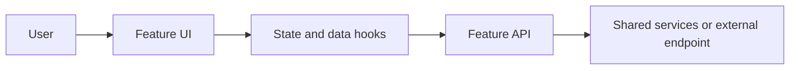

# Technical Specification: {{FEATURE_NAME}}

## Architecture Overview
{{Explain how the feature fits the existing application architecture.}}



## Project Structure
```text
src/
├── features/{{feature-slug}}/
│   ├── api/
│   ├── components/
│   ├── hooks/
│   ├── types/
│   └── index.ts
└── pages/
```

{{Replace or extend this example with the actual files relevant to the feature.}}

## Data Structures
### {{TYPE_NAME}}
```typescript
interface {{TYPE_NAME}} {
  // Define fields, types, and optionality.
}
```

## API and Service Layer
| Operation | Service or API | Input | Output | Behavior |
|-----------|----------------|-------|--------|----------|
| `{{operationName}}` | {{module or SDK operation}} | {{input}} | {{output}} | {{expected behavior}} |

{{Document endpoint configuration, request/response shapes, and resource cleanup as applicable. Reuse shared AWS client factories and settings where appropriate.}}

## State Management
### {{HOOK_OR_STATE_AREA}}
- State/query key: {{key}}
- Loading and empty behavior: {{behavior}}
- Refresh, caching, and invalidation: {{behavior}}
- Mutations and side effects: {{behavior}}

## UI/UX Details
### {{COMPONENT_OR_VIEW}}
- Content and actions: {{details}}
- Loading, empty, success, and error states: {{details}}
- Accessibility and responsive behavior: {{details}}

## Routing
| Path | View | Parameters |
|------|------|------------|
| `{{route}}` | {{page or component}} | {{parameters, if any}} |

## Error Handling
- {{Expected error}}: {{user-visible behavior and recovery}}

## Security and Configuration
- {{Credential, endpoint, storage, permissions, or data-handling constraints}}

## Dependencies
- {{New or existing package, shared module, or prerequisite; explain why}}
