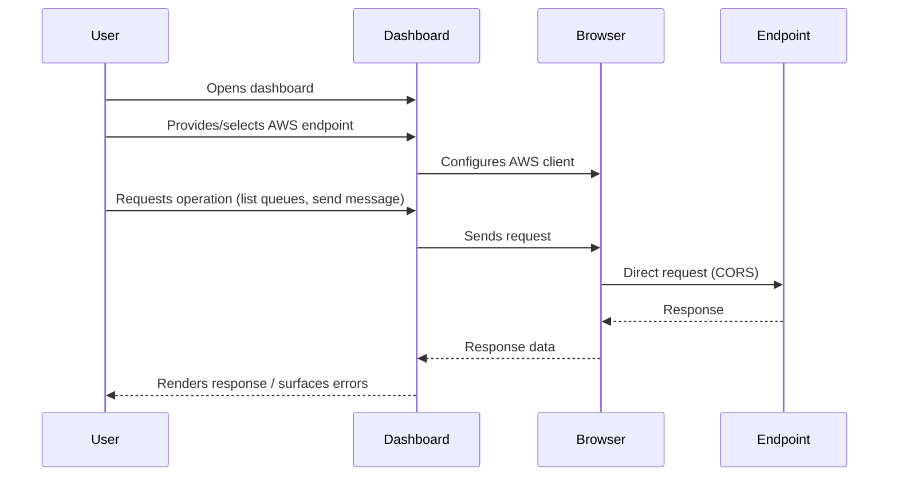

# Architecture

## Overview

This project is a client-side AWS resource dashboard built with React. It has no application backend: the browser sends requests directly to an AWS endpoint supplied by the user. The endpoint can be an AWS-compatible local service, such as the `ministackorg/ministack` container running on `localhost:4566`, or an appropriately configured AWS endpoint.

The initial resource workflow focuses on Amazon SQS. Users can inspect queues and perform supported queue operations from the dashboard. The application is intended to make local development and testing possible without deploying an application server.

## Application layers

```mermaid
graph TB
    subgraph Frontend
        Router[React Router<br/>Routing & Shell]
        UI[Tailwind + shadcn/ui<br/>User Interface]
        Config[Settings Context<br/>Endpoint & Region]
        
        subgraph SharedServices[Shared AWS Services]
            BaseClient[createSqsClient()<br/>Factory Pattern]
            ApiLayer[Resource API<br/>(list, CRUD ops)]
            Hooks[React Query Hooks<br/>(useQueues, etc.)]
        end
        
        subgraph SQSFeature[SQS Feature]
            SQSApi[features/sqs/api/sqs.ts]
            SQSHooks[features/sqs/hooks/]
            SQSComponents[features/sqs/components/]
            SQSPage[QueuesPage]
        end
        
        subgraph LambdaFeature[Lambda Feature]
            LambdaApi[features/lambda/api/lambda.ts]
            LambdaHooks[features/lambda/hooks/]
            LambdaComponents[features/lambda/components/]
            LambdaPage[LambdaPage]
        end
    end

    Router --> UI
    UI --> Config
    Config --> BaseClient
    BaseClient --> ApiLayer
    ApiLayer --> Hooks
    Hooks --> SQSComponents
    Hooks --> LambdaComponents
    SQSComponents --> SQSPage
    LambdaComponents --> LambdaPage
    SQSApi -.->|reuses| BaseClient
    LambdaApi -.->|reuses| BaseClient
    SQSHooks -.->|pattern| LambdaHooks
    SQSComponents -.->|patterns| LambdaComponents
    BaseClient --> Endpoint[(AWS-compatible<br/>Endpoint)]
```

- **Routing and application shell:** React Router organizes the dashboard routes and shared page layout.
- **User interface:** Tailwind CSS provides utility-based styling, and shadcn/ui-inspired primitives are used to build reusable interface components without depending on a one-off generated component command.
- **Shared AWS Services:** Reusable layer containing:
  - **Base Client Factory** (`src/services/aws.ts`): `createSqsClient()` pattern - extensible for Lambda, S3, DynamoDB
  - **API Layer Pattern** (`features/*/api/`): Consistent create-client → call → destroy pattern
  - **React Query Hooks Pattern** (`features/*/hooks/`): Standardized query keys, stale time, invalidation
- **SQS Feature:** Implements the patterns for queue operations
- **Lambda Feature:** Reuses base client factory, API pattern, hooks pattern, and component patterns from SQS
- **Configuration:** Settings context provides shared endpoint/region to all services

## Request flow



There is no application server between the browser and the AWS-compatible service. Consequently, the service endpoint must be reachable from the browser, and the service must permit the browser's cross-origin requests (CORS) where applicable.

## Local development and testing

Run `ministackorg/ministack` as a Docker container and expose its AWS-compatible API on port `4566`. Configure the dashboard to use `http://localhost:4566` as its endpoint. The dashboard and the container are separate processes: the React development server serves the frontend, while the container emulates the AWS APIs used by the application.

Local tests should verify that the dashboard can connect to the configured endpoint, list SQS queues, and perform the queue operations supported by the UI. Tests that mutate resources should use the local emulator and disposable test queues rather than a production AWS account.

## Security and operational boundaries

Because AWS requests originate in the browser, this application does not provide a secure place to store long-lived AWS credentials. Never bundle permanent access keys or secrets into frontend source, build-time environment variables, or browser storage. Use the local emulator for local development; for real AWS environments, use an explicitly designed short-lived credential flow and restrict permissions to the required resources and actions.

The browser must be able to reach the configured endpoint, and endpoint networking and CORS policy are the responsibility of that endpoint's environment. The frontend is responsible for presenting resource state and user actions, not for enforcing server-side authorization or protecting credentials.