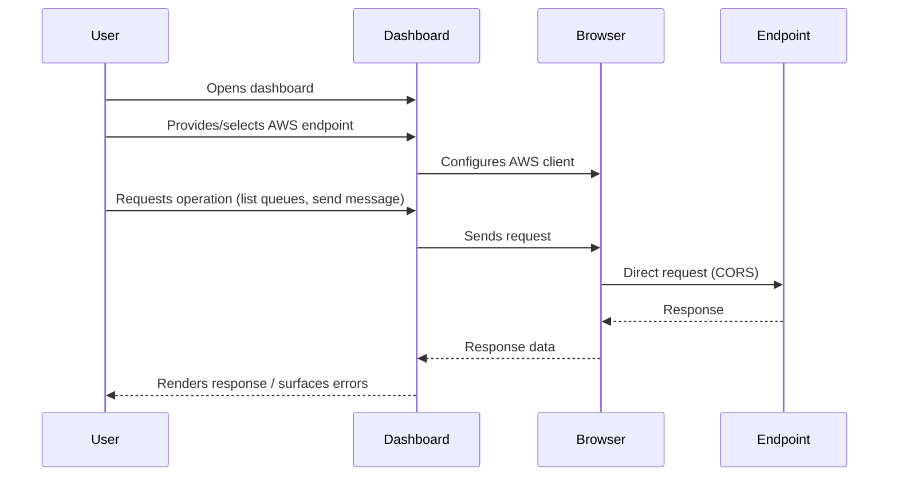

# Architecture

## Overview

This project is a client-side AWS resource dashboard built with React, TypeScript, Vite, and React Router. It has no application backend: the browser sends requests directly to an AWS endpoint supplied by the user. The endpoint can be an AWS-compatible local service, such as the `ministackorg/ministack` container running on `localhost:4566`, or an appropriately configured AWS endpoint.

The dashboard currently supports Amazon SQS queue inspection and operations, and AWS Lambda function inspection and invocation. The application is intended to make local development and testing possible without deploying an application server.

## Application Structure

```text
src/
├── components/
│   ├── layout/
│   └── ui/
├── features/
│   ├── lambda/
│   ├── settings/
│   ├── s3/
│   ├── dynamodb/
│   └── sqs/
├── lib/
├── pages/
├── services/
├── App.tsx
└── routes.ts

tests/
├── lib/
├── config/
├── features/
│   ├── s3/
│   │   ├── api/
│   │   ├── hooks/
│   │   └── components/
│   ├── dynamodb/
│   │   ├── api/
│   │   ├── hooks/
│   │   └── components/
│   └── sqs/
│       └── api/
└── pages/

scripts/
├── create-*.mjs              # Provision resources in local emulator
├── *-test-data.mjs           # Add deterministic sample data
└── *-test-data.test.mjs      # Validate helper scripts (not business logic tests)
```

### `scripts/` — Test Resource Helpers

The `scripts/` directory contains Node.js helpers that provision and exercise local AWS test resources for development. These are **setup helpers only**, not business logic:

- **Provisioning scripts** (e.g., `create-s3-test-bucket.mjs`, `create-dynamodb-test-table.mjs`, `create-sqs-lambda.mjs`): Create resources in the local emulator (MinStack). Safe to rerun; use dummy credentials; target `localhost:4566` by default.
- **Data seeding scripts** (e.g., `s3-test-data.mjs`, `dynamodb-test-data.mjs`, `put-dynamodb-test-items.mjs`, `send-sqs-test-message.mjs`): Insert deterministic sample data so the dashboard has content to display.
- **Validation tests** (e.g., `s3-test-data.test.mjs`, `dynamodb-test-data.test.mjs`): Verify the helper scripts work correctly. These are **not** unit tests for application code — they only validate the helper scripts themselves.

Unit tests for application code belong in `tests/` and follow the conventions below. The `scripts/` helpers do not use the `@/` alias or the `tests/` structure.

## Testing Conventions

Test files are located in a top-level `tests/` directory that mirrors the `src/` structure. This keeps test code separate from production source while maintaining clear organization.

- Unit tests for utilities, hooks, and API functions live under `tests/` mirroring their source locations
- Component tests use `@testing-library/react` with `jsdom` environment
- API tests use Vitest with a local HTTP server to verify request/response behavior
- Tests import source modules using the `@/` alias (e.g., `@/lib/useEndpointStatus`)
- The `tsconfig.json` includes both `src` and `tests` in the `include` array for type checking
- Vitest is configured in `vitest.config.ts` with the `@/` alias and includes `tests/**/*.test.{ts,tsx}` and `scripts/**/*.test.mjs`
- **Test helper scripts in `scripts/` (e.g., `s3-test-data.test.mjs`, `dynamodb-test-data.test.mjs`) validate the helper scripts themselves — they are not application unit tests and do not follow the `tests/` conventions.**

## Responsibilities

### `App.tsx`, `routes.ts`, and `pages/`

React Router defines the routes, `Layout` provides the shared application shell, and page components compose feature workflows.

### `components/ui/`

Project-owned, reusable UI primitives with project-specific styling. Components
are implemented and maintained in this repository; shadcn/ui is a design and
accessibility reference, not a runtime dependency or a source of generated
components that must be installed.

### `features/`

Feature-specific APIs, UI, hooks, types, settings context, and orchestration. Keep resource-specific behavior inside its feature.

### `lib/`

Generic helpers such as class-name utilities and endpoint status checks.

### `services/`

AWS SDK client factories shared by the features. There is no application backend; feature APIs call these clients from the browser.

## Feature Boundaries

Feature-specific code should remain inside its feature when possible.

Example:

```text
src/features/customers/
├── components/
├── hooks/
├── services/
├── types/
└── utils/
```

Shared code should only be promoted to `components/ui`, `lib`, or another
shared layer when there is a genuine reuse requirement.

## Application layers

```mermaid
graph TB
    subgraph Frontend
        Router[React Router<br/>Routing & Shell]
        UI[Tailwind + Project UI Components<br/>shadcn/ui as reference]
        Config[Settings Context<br/>Endpoint & Region]
        
        subgraph SharedServices[Shared AWS Services]
            BaseClient[createSqsClient()<br/>Factory Pattern]
            ApiLayer[Resource API<br/>(list, CRUD ops)]
            Hooks[React Query Hooks<br/>(useQueues, etc.)]
        end
        
        subgraph SQSFeature[SQS Feature]
            SQSApi[features/sqs/api/sqs.ts]
            SQSHooks[features/sqs/hooks/]
            SQSComponents[features/sqs/components/]
            SQSPage[QueuesPage]
        end
        
        subgraph LambdaFeature[Lambda Feature]
            LambdaApi[features/lambda/api/lambda.ts]
            LambdaHooks[features/lambda/hooks/]
            LambdaComponents[features/lambda/components/]
            LambdaPage[LambdaPage]
        end
    end

    Router --> UI
    UI --> Config
    Config --> BaseClient
    BaseClient --> ApiLayer
    ApiLayer --> Hooks
    Hooks --> SQSComponents
    Hooks --> LambdaComponents
    SQSComponents --> SQSPage
    LambdaComponents --> LambdaPage
    SQSApi -.->|reuses| BaseClient
    LambdaApi -.->|reuses| BaseClient
    SQSHooks -.->|pattern| LambdaHooks
    SQSComponents -.->|patterns| LambdaComponents
    BaseClient --> Endpoint[(AWS-compatible<br/>Endpoint)]
```

- **Routing and application shell:** React Router organizes the dashboard routes and shared page layout.
- **User interface:** Tailwind CSS styles project-owned reusable components. shadcn/ui is consulted as a reference for common patterns and accessibility.
- **Shared AWS Services:** Reusable layer containing:
  - **AWS Client Factories** (`src/services/aws.ts`): `createSqsClient()` and `createLambdaClient()`, configured from shared endpoint and region settings
  - **API Layer Pattern** (`features/*/api/`): Consistent create-client → call → destroy pattern
  - **React Query Hooks Pattern** (`features/*/hooks/`): Standardized query keys, stale time, invalidation
- **SQS Feature:** Implements the patterns for queue operations
- **Lambda Feature:** Reuses base client factory, API pattern, hooks pattern, and component patterns from SQS
- **Configuration:** Settings context provides shared endpoint/region to all services

## UI Architecture

- This React Router/Vite application owns its UI primitives in `src/components/ui/`; shadcn/ui is a reference for common patterns and accessibility, not a component package or required code generator.
- Before creating a reusable primitive or common interface pattern, first check `src/components/ui/` and reuse or extend an appropriate project component.
- Consult the official [shadcn/ui component catalog](https://ui.shadcn.com/docs/components) as a reference for established patterns, composition, and accessibility considerations.
- Do not install or generate shadcn/ui components as the default workflow. Implement or adapt the component locally to fit the project's visual system, dependencies, and requirements.
- Create a custom primitive when no suitable project component exists, and put it in `src/components/ui/`. Keep domain-specific compositions in their feature directory.
- Use Tailwind CSS to style and compose project-owned primitives, avoiding duplicated structure and interaction behavior.
- Keep business logic out of presentation primitives; feature components should own resource-specific behavior.

## Request flow



There is no application server between the browser and the AWS-compatible service. Consequently, the service endpoint must be reachable from the browser, and the service must permit the browser's cross-origin requests (CORS) where applicable.

## Local development and testing

Run `ministackorg/ministack` as a Docker container and expose its AWS-compatible API on port `4566`. Configure the dashboard to use `http://localhost:4566` as its endpoint. The dashboard and the container are separate processes: the React development server serves the frontend, while the container emulates the AWS APIs used by the application.

Local tests should verify that the dashboard can connect to the configured endpoint, list SQS queues, and perform the queue operations supported by the UI. Tests that mutate resources should use the local emulator and disposable test queues rather than a production AWS account.

## Security and operational boundaries

Because AWS requests originate in the browser, this application does not provide a secure place to store long-lived AWS credentials. Never bundle permanent access keys or secrets into frontend source, build-time environment variables, or browser storage. Use the local emulator for local development; for real AWS environments, use an explicitly designed short-lived credential flow and restrict permissions to the required resources and actions.

The browser must be able to reach the configured endpoint, and endpoint networking and CORS policy are the responsibility of that endpoint's environment. The frontend is responsible for presenting resource state and user actions, not for enforcing server-side authorization or protecting credentials.

## Data Flow

Prefer:

```text
UI → feature logic → service → backend
```

rather than coupling UI components directly to external data sources.